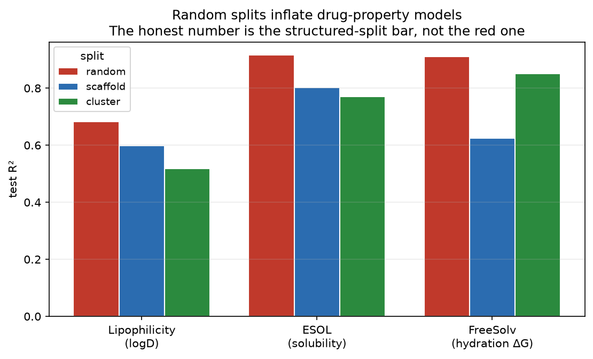
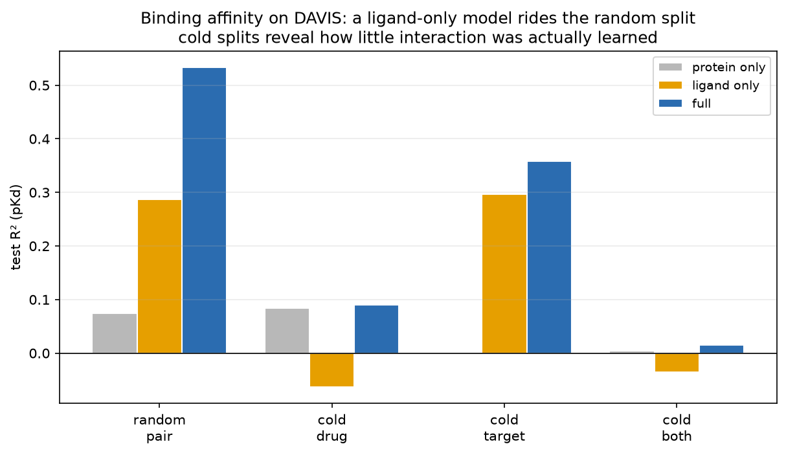

# SMPro1

**Honest evaluation for drug-discovery ML — property prediction and binding affinity, with the leakage measured instead of assumed.**


&nbsp;·&nbsp; MIT &nbsp;·&nbsp; Python 3.10–3.12

A molecular ML model that looks excellent on a random train/test split can be nearly useless on the next chemical series a project actually wants to make. Chemical datasets are dense with near-duplicate analogues, so a random test set almost always has a close cousin in training — the model interpolates and the score is inflated. This is the problem a wave of 2026 work is built around (*HonestAffinity*, PDBbind **CleanSplit**, *Systematic Data Leakage in Protein-Ligand Benchmarks*). `smpro1` measures it, and reports the number that survives it.



## The result

Same model and features on three standard benchmarks — **only the split changes:**

| dataset | random R² | scaffold R² | cluster R² | random inflated by |
|:---|---:|---:|---:|---:|
| Lipophilicity (logD) | 0.68 | 0.60 | 0.52 | +12–31% |
| ESOL (aqueous solubility) | 0.92 | 0.80 | 0.77 | +12% |
| **FreeSolv (hydration ΔG)** | **0.91** | **0.63** | 0.85 | **+31%** |

FreeSolv is the cautionary tale: **R² = 0.91 on a random split, 0.63 on new scaffolds — and RMSE more than doubles, 1.26 → 3.13 kcal/mol.** A team trusting the 0.91 would ship a model that fails on novel chemistry.

The leakage is not asserted, it's measured. `split_difficulty()` reports how far each test set really sits from training:

| split | median nearest-neighbour similarity to train | test with a >0.9 near-duplicate in train |
|:---|---:|---:|
| random | ~0.53 | **6–8%** |
| scaffold | ~0.30 | 0–1% |
| cluster | ~0.32 | 0% |

The random split leaks — several percent of its test set has a near-twin in training — which is exactly why its scores are inflated.

## A physical-chemistry reading

The inflation is **largest for the most physical target.** Hydration free energy (FreeSolv) is a literal ΔG — an interaction energy set by specific functional groups and geometry — so a genuinely new scaffold changes it in ways an interpolating model can't see, and the honest (scaffold) score drops hardest. Solubility and lipophilicity are softer, smoother functions of structure, and leak less. Binding affinity, molecular stability, and glass-transition temperature are the same object at other scales: **a free energy over a geometry.** Evaluating any of them on a random split measures memorisation, not the physics.

## Run it

```bash
git clone https://github.com/DrGregPitch/SMPro1 && cd SMPro1
uv venv && uv pip install -e ".[dev]"        # pulls the model ladder from polytools
uv run python scripts/run_leakage_benchmark.py --outdir results   # ~1 min: table + figure
uv run pytest tests -v
```

Datasets are the canonical MoleculeNet / Therapeutics Data Commons regression sets, downloaded on demand (no data committed).

## What's inside

- **Honest splitters, implemented** (`splits.py`) — random, Bemis–Murcko scaffold, and Butina-cluster, plus `split_difficulty()`, which *measures* how out-of-distribution a split is rather than asserting it. Note the hardest split isn't always the same one (scaffold is hardest for FreeSolv, cluster for Lipophilicity) — reported, not glossed.
- **Model ladder + calibration, reused from [`polytools`](https://github.com/DrGregPitch/polytools)** — the same honest-evaluation infrastructure built for polymers works unchanged on drug-like molecules, because a feature matrix doesn't care what kind of molecule it came from. Gradient boosting on ECFP + medicinal-chemistry descriptors, with deep-ensemble uncertainty and a `SigmaRecalibrator`.
- **Med-chem featurization** (`featurize.py`) — ECFP4 fingerprints + the descriptor block a chemist reads off a structure (MolWt, LogP, TPSA, HBD/HBA, …). Deliberately classical, so no fancy model can hide a leaky split behind an impressive number.

---

## Binding affinity: where does the performance actually come from?

Property prediction leaks through *similar molecules*. Drug–target **binding affinity** leaks through something worse: a pair can leak through *either side*. On a random split of (drug, target) pairs, a model can score well by memorizing each drug's promiscuity and each target's affinity level — without learning anything about the interaction between them. The 2026 literature (HonestAffinity, PDBbind CleanSplit) is largely about catching this.

`smpro1.dti` catches it two ways, on the **DAVIS** kinase panel (68 inhibitors × ~379 kinases, dissociation constants; pKd is a free energy, ΔG = −RT ln Kd, ≈1.36 kcal/mol per unit):

1. **Single-sided baselines** — a **protein-only** and a **ligand-only** model. Neither can see the interaction, so any score they earn is memorization *by construction*.
2. **Cold splits** — hold out drugs, targets, or both, so "will it work on new chemistry / a new target?" is actually the question asked.



| model | random pair | cold drug | cold target | cold both |
|:---|---:|---:|---:|---:|
| protein-only (memorization) | 0.07 | 0.08 | −0.00 | 0.00 |
| ligand-only (memorization) | 0.29 | −0.06 | 0.30 | −0.04 |
| **full (ligand + protein)** | **0.53** | **0.09** | **0.36** | **0.02** |

*Test R² on pKd.* Three things a single random-split number would have hidden:

- **The full model's 0.53 is mostly not interaction.** A ligand-only model — which literally never sees the protein it is scoring against — reaches 0.29 on the same split. The *interaction gap* (full minus the best single-sided baseline) is only **+0.25**.
- **Cold-both is essentially unsolved.** For a genuinely new drug against a new target, every model sits at R² ≈ 0. That is the honest state of ligand-based binding prediction, and it is the deployment scenario that matters.
- **The asymmetry is the tell, and it's the dataset's shape.** On `cold_target`, ligand-only (0.30) nearly matches full (0.36): with only 68 drugs — all seen in training — the model rides drug identity. On `cold_drug`, ligand-only goes *negative*: new chemistry breaks the memorization it was leaning on. Which side leaks depends on which side is small.

Run it: `python scripts/run_binding_benchmark.py`.

## Part of a portfolio

`smpro1` extends the honest-evaluation thesis from polymers into drug discovery. Companion repos:

- [**polytools**](https://github.com/DrGregPitch/polytools) — the harness this reuses; polymer property prediction.
- [**copolybench**](https://github.com/DrGregPitch/copolybench) — copolymer representation learning.
- [**formulate**](https://github.com/DrGregPitch/formulate) — active learning for formulation.

## Limitations

Binding uses sequence-composition protein features, not 3D structure or docking — that's the next tier. DAVIS is a single kinase panel censored at pKd 5 (mostly non-binders), and the property benchmarks are three regression sets chosen to make the leakage point cleanly: the leakage *pattern* is general, the exact numbers are dataset-specific. Scaffold and cluster splits are strong structured splits but not the last word — time-based splits stress a model differently again.

## License

MIT.
